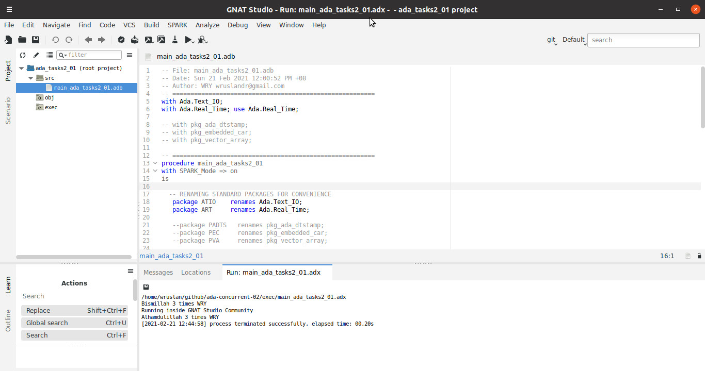

# ada-concurrent-02
Concurrency in Ada2012 

2021-02-22 03:32:26.99066656468 Running tsktyp_01 --> tsk_display_speed(100 msec cycle)

2021-02-22 03:32:27.09166862213 Running tsktyp_01 --> tsk_display_speed(100 msec cycle)

2021-02-22 03:32:27.19265469319 Running tsktyp_03 --> tsk_monitor_engine(500 msec cycle)

2021-02-22 03:32:27.19265733881 Running tsktyp_02 --> tsk_read_speed(250 msec cycle) 

2021-02-22 03:32:27.44515937789 Running tsktyp_02 --> tsk_read_speed(250 msec cycle) 

2021-02-22 03:32:27.69765665802 Running tsktyp_03 --> tsk_monitor_engine(500 msec cycle)

2021-02-22 03:32:27.69766098152 Running tsktyp_02 --> tsk_read_speed(250 msec cycle) 

2021-02-22 03:32:27.94016285511 Running tsktyp_02 --> tsk_read_speed(250 msec cycle) 

2021-02-22 03:32:28.19265856217 Running tsktyp_03 --> tsk_monitor_engine(500 msec cycle)

2021-02-22 03:32:28.19266465656 Running tsktyp_02 --> tsk_read_speed(250 msec cycle) 

